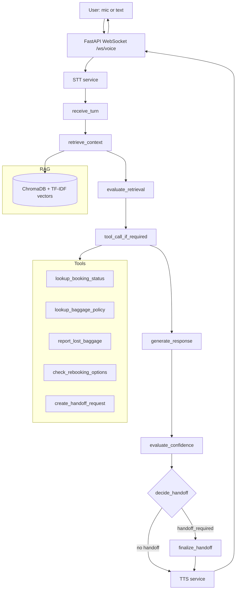

# Real-Time Travel Support Voice Agent

A portfolio project: a voice/text support agent for a fictional airline,
built with FastAPI, LangGraph, ChromaDB (RAG), tool/function calling, and
a WebSocket streaming protocol designed for STT → LLM agent → TTS.

> **Authenticity note (read this first):** this project runs, is tested,
> and can be evaluated with **zero API keys**, using deterministic mock
> implementations for the LLM, STT, and TTS. It does **not** claim
> production deployment, real users, real airline integrations, or
> measured sub-500ms latency. See [Limitations](#limitations) and
> [docs/ARCHITECTURE.md](docs/ARCHITECTURE.md) for exactly what is real
> vs. mocked, and why.

## Problem statement

Airline customer support handles a small number of recurring request
types (cancellations, delays, baggage, refunds, rebooking, documentation)
that are well suited to RAG + tool calling, but a subset of requests
(fraud, medical emergencies, lost documents, low-confidence answers)
must reliably escalate to a human. This project builds and evaluates
that routing logic end-to-end, with the orchestration, confidence
scoring, and evaluation methodology treated as the actual deliverable —
not just the LLM call.

## Architecture



See [docs/ARCHITECTURE.md](docs/ARCHITECTURE.md) for why the LangGraph
routing is real (not decorative) and a full real-vs-mock component table.

## Tech stack

Python 3.12, FastAPI, WebSockets, LangGraph, ChromaDB, scikit-learn
(TF-IDF embeddings), Pydantic v2, pytest, Docker, GitHub Actions.
Optional real backends: OpenAI-compatible chat completions,
faster-whisper, ElevenLabs.

## Setup

```bash
git clone <your-fork-url>
cd real-time-travel-support-voice-agent
python -m venv .venv && source .venv/bin/activate   # optional but recommended
pip install -r requirements.txt
cp .env.example .env   # optional -- everything runs in mock mode with no keys
python scripts/ingest.py
```

### Environment variables
All optional (see `.env.example`); absence of a key means that service
runs in its documented mock mode:
`OPENAI_API_KEY`, `OPENAI_MODEL`, `ELEVENLABS_API_KEY`,
`ELEVENLABS_VOICE_ID`, `WHISPER_MODEL_SIZE`, `HOST`, `PORT`, `LOG_LEVEL`.

## Running it

```bash
uvicorn app.main:app --reload
# then open frontend/index.html in a browser (or serve it: python -m http.server 5500 --directory frontend)
```

Check it's alive:
```bash
curl http://localhost:8000/health
```

## Testing

```bash
python -m pytest tests/ -v
```
31 tests, all passing, all offline (mocks external services; no network
or API key required). Covers: health, RAG retrieval, tool calling,
handoff logic, confidence heuristic, LangGraph workflow structure
(including the conditional handoff edge), the full WebSocket protocol,
and malformed-request handling.

## Evaluation

```bash
python scripts/evaluate.py
```
Runs all 30 hand-labeled synthetic conversations through the real
pipeline and computes retrieval precision/hit-rate, tool-call success,
handoff accuracy, groundedness, and per-stage latency. Full methodology,
real (unedited) results, and the honest list of weaknesses this
evaluation surfaced are in [docs/EVALUATION.md](docs/EVALUATION.md).

## WebSocket protocol

Full event reference in [docs/API.md](docs/API.md). Summary:
client sends `start | audio | text | end`; server sends
`ready | transcript | agent_response | audio_response | metrics | handoff | error | end`.

### Example conversation
```
> {"type": "text", "text": "What is the checked baggage weight limit?"}
< {"type": "agent_response", "payload": {"text": "Based on our travel-support policy: Economy passengers are allowed one checked bag up to 23kg... Tool lookup (lookup_baggage_policy) returned: {'checked_kg': 23, ...}.", "confidence": 0.564}}
< {"type": "audio_response", "payload": {"audio_base64": "...", "is_mock_tts": true}}
< {"type": "metrics", "payload": {"retrieval_ms": 1.4, "tool_ms": 0.02, "llm_ms": 0.01, "tts_ms": 3.1, "total_ms": 4.6}}
```

## Latency methodology

Each stage (`stt_ms`, `retrieval_ms`, `tool_ms`, `llm_ms`, `tts_ms`,
`total_ms`) is timed independently with `time.perf_counter()` (monotonic)
*inside* the code that does the work — see
`app/observability/metrics.py` and the per-turn timer registry in
`app/graph/nodes.py`. No latency number in this repo is a target or an
estimate; every one is measured from an actual run. Measured mock-mode
totals average ~4-5ms end-to-end (excluding STT/TTS, which are near-
instant in mock mode) — this says nothing about real-model latency and
is not presented as a production number.

## Limitations

- **LLM**: mock mode is extractive (grounds in retrieved docs / tool
  results, or admits it doesn't know) — never a free-generating LLM
  unless `OPENAI_API_KEY` is set, and the real-LLM code path is untested
  in this environment (no network access to api.openai.com here).
- **STT**: no real audio transcription is happening in mock mode — the
  frontend records real audio, but the offline STT mock decodes
  UTF-8-encoded ground-truth text sent as the "audio" payload as a
  protocol stand-in. faster-whisper integration code exists but needs
  model weights this sandbox couldn't download.
- **TTS**: mock mode returns a valid, silent WAV file, not synthesized
  speech. Real ElevenLabs code path exists but is untested here (no
  network access to api.elevenlabs.io in this sandbox).
- **Barge-in**: the cancellation *abstraction* (`PlaybackController`) is
  real and wired into the WebSocket handler, but there's nothing to
  truly interrupt mid-stream since mock TTS returns complete files, not
  a live stream.
- **No real airline integration**: every "tool" is backed by an
  in-memory synthetic dataset, by design.
- **Retrieval is TF-IDF, not semantic embeddings** — see
  docs/ARCHITECTURE.md for why, and docs/EVALUATION.md for the
  measured precision/recall impact.
- **Confidence is a documented heuristic**, not a calibrated model.

## Future improvements

- Real embeddings (or hybrid TF-IDF + reranker) for semantic retrieval.
- Real streaming STT/TTS with genuine mid-stream barge-in cancellation.
- Calibrate the confidence heuristic against labeled handoff outcomes.
- Prometheus/Grafana metrics export.
- Multi-turn conversation memory (currently single-turn per WebSocket message).

## Folder structure

```
real-time-travel-support-voice-agent/
├── app/
│   ├── main.py, config.py, schemas.py
│   ├── graph/          # LangGraph state, nodes, workflow
│   ├── rag/            # ingest, vector store, retriever
│   ├── tools/          # booking, baggage, rebooking, handoff, registry
│   ├── services/       # stt, llm, tts, audio
│   └── observability/  # logging, metrics
├── frontend/            # HTML/CSS/JS demo client
├── data/
│   ├── knowledge_base/  # synthetic policy docs
│   └── evaluation/      # eval set + generated report
├── scripts/             # ingest.py, evaluate.py
├── tests/               # 31 pytest tests, fully offline
├── docs/                # ARCHITECTURE.md, EVALUATION.md, API.md
├── .github/workflows/ci.yml
├── Dockerfile, docker-compose.yml
└── requirements.txt
```

## License

MIT — see [LICENSE](LICENSE).
